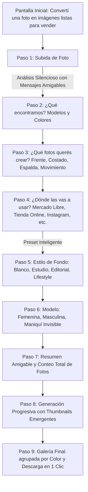

# Documentación: Frontend Visual Wizard (Catalog AI)

## 1. Visión y Principio Rector

El nuevo frontend de **Catalog AI** fue concebido y desarrollado bajo una regla estricta:
> **"El backend decide y protege la prenda; el frontend solamente pregunta intenciones."**

El usuario final nunca se enfrenta a conceptos técnicos de IA o ingeniería como:
- *BoundingBox, GarmentDNA, ProductGroup, ReferenceSet, segmentation, confidence scores, SHA-256, SourceImage, Gemini, Fal.ai, FLUX, validation gates*.

La experiencia se siente como un **asistente de producción fotográfica digital**, guiando al comerciante o marca de moda desde la foto cruda hasta un catálogo de fotografías comerciales listas para vender en marketplaces y e-commerce.

---

## 2. Mapa UX & Flujo de Pasos

---

## 3. Desglose de Pantallas y Componentes

### Pantalla Inicial (`WelcomeScreen.tsx`)
- Título principal: *"Convertí una foto de tu prenda en imágenes listas para vender"*.
- Dos cards visuales grandes:
  1. **Subir una prenda** (ideal para fotos individuales en percha, maniquí o modelo).
  2. **Foto con varios colores** (detección y separación de variantes múltiples alineadas).
- CTA central prominente: *"Subir foto de mi prenda"*.

### Paso 1 — Subida (`UploadStep.tsx`)
- Drag & Drop amigable para una o múltiples imágenes (JPG, PNG, WebP).
- Mientras el backend ejecuta la inferencia multimodal, Sharp cropping y extracción de DNA, el usuario ve una animación sutil con mensajes dinámicos:
  - *"Analizando tu prenda..."*
  - *"Detectando prendas"*
  - *"Separando colores"*
  - *"Revisando detalles"*

### Paso 2 — ¿Qué encontramos? (`DetectedProductsStep.tsx`)
- Comunica en lenguaje natural el hallazgo:
  - *"Encontramos 1 modelo en 5 colores"* o *"Encontramos 2 modelos distintos"*.
- Tarjetas grandes con el recorte físico de la prenda, muestra de color cromático y selección multi-choice intuitiva.

### Paso 3 — ¿Qué fotos querés crear? (`ShotsStep.tsx`)
- Miniaturas visuales con selección múltiple:
  - **Frente**: Vista principal de impacto.
  - **Costado**: Silueta y perfil.
  - **Espalda**: Cierre y terminaciones posteriores.
  - **En movimiento**: Caída y dinamismo del tejido.

### Paso 4 — ¿Dónde vas a usar las fotos? (`DestinationStep.tsx`)
- Opciones orientadas a canales de venta:
  - **Mercado Libre**: Preselecciona automáticamente Fondo Blanco y ratio 1:1.
  - **Tienda Online**: Preselecciona Estudio Premium suave.
  - **Catálogo Mayorista**: Preselecciona estilo Editorial.
  - **Instagram & Redes**: Preselecciona Lifestyle con luz natural.

### Paso 5 — Elegir estilo (`StyleStep.tsx`)
- Thumbnails con ejemplos visuales de iluminación y fondo:
  - *Fondo Blanco* (con badge "Recomendado para Mercado Libre").
  - *Estudio Premium*.
  - *Editorial de Moda*.
  - *Lifestyle Urbano*.

### Paso 6 — Modelo (`ModelStep.tsx`)
- Selector visual de modelos virtuales (femeninas, masculinas) o la opción de *Maniquí Invisible (Ghost Mannequin)* para mostrar la prenda con volumen sin presencia humana.

### Paso 7 — Resumen (`SummaryStep.tsx`)
- Tarjeta de impacto: *"Tu producción: 5 colores × 4 fotos = 20 imágenes comerciales"*.
- Muestra el canal, modelo y estilo seleccionados.
- CTA definitivo: *"Crear producción"*.

### Paso 8 — Generación (`GenerationStep.tsx`)
- Barra de progreso general y tarjetas individuales por colorway:
  - `Negro: 4/4 [✓]`
  - `Rojo:  3/4 [En curso...]`
  - `Verde: 1/4 [Preparando frente...]`
- Miniaturas emergentes a medida que cada ángulo se completa y valida.

### Paso 9 — Galería de Resultados (`ResultsGalleryStep.tsx`)
- Galería agrupada por variante cromática.
- Acciones directas:
  - *Descargar todas (en lote)*.
  - *Descargar este color*.
  - *Regenerar ángulo*.
  - *Comenzar nueva producción*.

---

## 4. Desacoplamiento Arquitectónico (Capa de Adaptadores)

Para garantizar que el frontend nunca manipule estructuras complejas de backend, se diseñó la capa de ViewModels y Adaptadores en `features/wizard/models/wizard.types.ts`:

| Entidad Backend (Técnica) | ViewModel Frontend (Usuario) | Transformación Realizada |
|---|---|---|
| `SceneAnalysisPipelineResult` | `ProductChoiceViewModel[]` | Agrupa detecciones en modelos comerciales con títulos amigables y recortes. |
| `GarmentVariant` | `ColorChoiceViewModel` | Extrae nombre canónico, hex y thumbnail del recorte. |
| `GenerationJob[]` | `GenerationProgressItem[]` | Mapea jobs técnicos a conteo `X/Y`, estados humanos y fotos terminadas. |
| `GarmentReference` | `ShotChoiceViewModel` | Traduce códigos de orientación a etiquetas familiares con fotos de ejemplo. |

---

## 5. Diseño Responsive y Layouts

- **Desktop**: Layout dividido en 12 columnas:
  - 8 columnas a la izquierda con el paso activo y opciones.
  - 4 columnas a la derecha con un **Live Preview permanente** de la prenda recortada, colores elegidos y presets activos.
- **Mobile**: Apilamiento vertical fluido optimizado para dedos, con tarjetas grandes y botón de acción principal fácilmente accesible.

---

## 6. Mantenimiento de Herramientas Internas

El inspector técnico previo (`SceneAnalysisInspector` y `GarmentDNAInspector`) no fue eliminado; fue reubicado a la ruta protegida interna:
- `/admin/inspector`

Esto permite al equipo de ingeniería auditar píxeles, bounding boxes, matrices cromáticas y reglas HARD de Garment DNA sin contaminar el flujo público de usuario.
