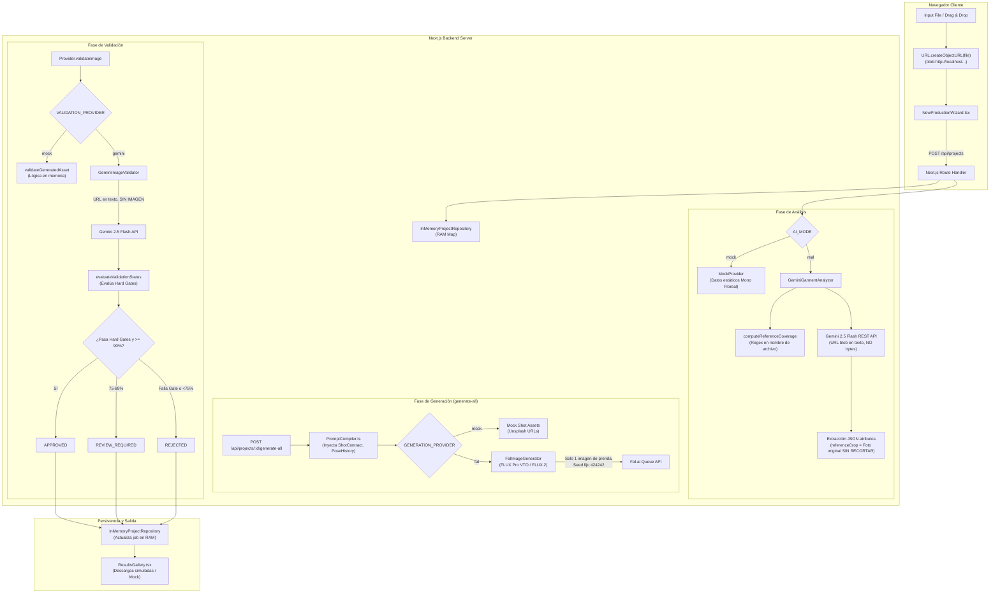

# INFORME FORENSE Y AUDITORÍA TÉCNICA DEL PIPELINE DE IMÁGENES
**Proyecto:** Catalog AI (`imagen`)  
**Fecha de Auditoría:** 26 de Septiembre de 2026  
**Tipo de Documento:** Informe de Auditoría de Código y Arquitectura Real (Read-Only Audit)  
**Alcance:** Pipeline de entrada, análisis de visión, modelado de identidad, síntesis generativa, validación y persistencia.

---

## 1. Resumen Ejecutivo

El presente informe constituye una auditoría técnica forense del código fuente implementado en la aplicación **Catalog AI**. El objetivo del sistema es transformar fotografías heterogéneas de prendas de vestir (prenda sola, maniquí, percha, modelo real, múltiples variantes de color en una misma foto, o fotos de detalle/espalda) en sets comerciales fotográficos de catálogo (Mercado Libre y Editorial), manteniendo estricta fidelidad al producto base ("Garment Lock") y a la modelo ("Model Lock").

### Hallazgo Central
El sistema cuenta con un **diseño conceptual y de interfaces muy avanzado** (estructuración de fichas técnicas, contratos de pose `ShotContract`, memoria de poses `ProductionPoseHistory`, políticas de validación con *Hard Gates* y modo dual mock/real). Sin embargo, al examinar la implementación real del código existe un **desacople severo entre el contrato teórico y el flujo real de datos**:

1. **Ruptura de Uploads Reales (`blob:` URLs):** La UI genera URLs mediante `URL.createObjectURL(file)`. Estas URLs `blob:` son efímeras del navegador cliente. Al enviarse a la API de Next.js (`/api/projects`), el servidor no puede descargarlas ni enviarlas a servicios externos.
2. **Ceguera en la Integración con Gemini Vision:** En `GeminiGarmentAnalyzer`, si la imagen no es un `data:base64`, se inyecta la URL como texto plano dentro del prompt (`[REFERENCE IMAGE URL: ...]`), con lo cual Gemini no recibe los bytes de la imagen. Más grave aún: en `GeminiImageValidator`, **no se adjunta ninguna imagen** en la petición REST a Gemini (solo se interpolan URLs como texto dentro del prompt), por lo que la "auditoría visual" de Gemini evalúa texto, no píxeles.
3. **Ausencia de Segmentación y Detección de Objetos:** Para variantes de color en una misma fotografía (ej. 5 vestidos en una percha o plano cenital), no existe detección de cajas delimitadoras (Bounding Boxes), segmentación semántica (SAM), ni clustering cromático (K-Means/CIELAB). La asignación de `referenceCrop` para cada variante se realiza mediante un índice circular (`idx % referenceImages.length`), asignando la foto completa sin recortar.
4. **Descarte de Vistas Múltiples en la Generación:** Aunque el usuario cargue frente, espalda y detalles, el generador real `FalImageGenerator` (FLUX Pro VTO / FLUX.2) solo envía **una única imagen** (`garment_image_url`). Las referencias de espalda y detalles son descartadas al llamar al motor generativo.
5. **Falta de Bucle Automático de Auto-Regeneración:** No existe un ciclo `generate → validate → reject → regenerate`. Si una imagen es rechazada, queda en estado `REJECTED` a la espera de que el usuario haga clic manual en la interfaz.
6. **Persistencia Volátil y Exportación Cosmética:** La base de datos es un `Map` en memoria (`InMemoryProjectRepository`). La descarga de lotes o ZIP en `ResultsGallery` es una simulación (`setTimeout` con toast); no genera archivos comprimidos ni exporta metadatos a plataformas de e-commerce.

---

## 2. Arquitectura Actual

El proyecto está construido sobre:
- **Framework:** Next.js 16.3.6 (App Router), React 19.2.8, TypeScript en modo estricto.
- **Estilos:** Tailwind CSS v4 con paleta oscura editorial.
- **Validación de Esquemas:** Zod 4.6.5.
- **Patrón de Arquitectura:** *Provider Strategy* desacoplado (`ImageGenerationProvider`) con soporte para switch entre `MockImageGenerationProvider` y `RealImageGenerationProvider` (Gemini Flash + Fal.ai).

### Configuración del Entorno (`lib/ai/config.ts`)
| Rol | Variable de Entorno | Valor Predeterminado | Implementación Real |
| :--- | :--- | :--- | :--- |
| **Modo General** | `AI_MODE` | `'mock'` | Switch en `lib/ai/index.ts` |
| **Analizador de Prendas** | `ANALYSIS_PROVIDER` | `'gemini'` | `GeminiGarmentAnalyzer` (`gemini-2.5-flash`) |
| **Generador de Imágenes** | `GENERATION_PROVIDER` | `'fal'` | `FalImageGenerator` (`fal-ai/flux-pro/v1/vto`) |
| **Validador de Calidad** | `VALIDATION_PROVIDER` | `'gemini'` | `GeminiImageValidator` (`gemini-2.5-flash`) |
| **Tope de Costos** | `MAX_REAL_GENERATIONS` | `8` | Guardia en `/api/projects/[id]/generate-all` |
| **Modo de Persistencia** | `STORAGE_MODE` | `'mock'` | `InMemoryProjectRepository` (en memoria RAM) |

---

## 3. Flujo Completo de Imágenes (Real vs Ideal)

A continuación se documenta el recorrido paso a paso que realiza una imagen desde que el usuario interactúa con la aplicación:

```
[UI: NewProductionWizard]
   │  Input: <input type="file" multiple> o Presets
   │  Procesamiento: URL.createObjectURL(file) -> blob:http://localhost:3000/...
   ▼
[API: POST /api/projects]
   │  Recibe array de ImageAsset con URLs blob:
   ▼
[ANALYSIS: Provider.analyzeGarment]
   ├─► Si AI_MODE=mock: Retorna GarmentLock estático con 6 variantes predefinidas (Mono Floreal).
   └─► Si AI_MODE=real (GeminiGarmentAnalyzer):
         ├─ coverage = computeReferenceCoverage(referenceImages) [heurística por nombre de archivo]
         └─ fetch(Gemini REST API):
              * Si url empieza con data: -> inline_data (base64)
              * Si url es blob: o http: -> Inyecta string [REFERENCE IMAGE URL: ...]
              * Gemini devuelve JSON con: name, category, material, pattern, details, mustPreserve, colorVariants
              * referenceCrop de cada variante = referenceImages[idx % length].url (SIN RECORTE REAL)
   ▼
[STORAGE: InMemoryProjectRepository]
   │  Crea Project en un Map<string, Project> en memoria del proceso Node.js.
   ▼
[UI: ProductionDetailView]
   │  Muestra Ficha Técnica (GarmentLockCard), Selector de Modelo (ModelLockSelector)
   │  y Calculador de Matriz (ProductionPackageSelector).
   ▼
[ACTION: POST /api/projects/[id]/generate-all]
   │  Evalúa Cost Guard (en modo real: máximo 1 variante activa y <= 8 fotos).
   │  Itera: activeVariants × stylesToProduce × 4 canonical shots [FRONT, SIDE, BACK, ACTION].
   ▼
[GENERATION: FalImageGenerator.generate]
   │  1. compileGenerationPrompt(request) -> compila texto enriquecido.
   │  2. garmentImageUrl = colorVariant.referenceCrop || referenceImages[0].url (SOLO 1 IMAGEN).
   │  3. humanImageUrl = modelLock.previewUrl (URL externa de Unsplash).
   │  4. payload = { prompt, garment_image_url, human_image_url, seed: 424242, category: 'one-pieces' }
   │  5. fetch('https://queue.fal.run/fal-ai/flux-pro/v1/vto') -> Polling hasta COMPLETED.
   │  6. Retorna ImageAsset con URL de Fal.ai CDN.
   ▼
[VALIDATION: Provider.validateImage]
   │  Llamada a GeminiImageValidator.validate()
   │  NOTA: Se hardcodea variante[0] y shotView='FRONT' en la llamada del RealProvider!
   │  Petición Gemini REST: Se envían únicamente textos en contents.parts (NO se adjuntan imágenes).
   │  Gemini infiere scores numéricos teóricos y failedGates.
   │  evaluateValidationStatus() determina: APPROVED | REVIEW_REQUIRED | REJECTED.
   ▼
[REGENERATION (Manual)]:
   │  Si falla un Hard Gate, queda en REJECTED.
   │  El usuario debe oprimir "Regenerar" en la tarjeta.
   │  POST /api/projects/[id]/jobs con action: 'REGENERATE'.
   │  Valida canAttemptRegeneration (máx. 3 intentos).
   ▼
[OUTPUT & GALLERY]:
   │  Las URLs se muestran en ResultsGallery.tsx.
   │  Botones de descarga masiva son simulaciones visuales con toast.
```

---

## 4. Entrada y Manejo de Imágenes (Uploads)

| Parámetro | Estado Actual | Detalle Técnico | Archivo / Función |
| :--- | :--- | :--- | :--- |
| **Una sola imagen** | Soportado | Se procesa dentro del array `images: ImageAsset[]`. | `NewProductionWizard.tsx` |
| **Múltiples imágenes** | Soportado (1 a 6) | `MAX_REFERENCE_IMAGES = 6` definido en Zod schema. | `lib/schemas/project.ts` |
| **Drag & Drop** | Soportado en UI | Elemento `<label htmlFor="photo-upload">` interactivo. | `NewProductionWizard.tsx:296` |
| **Preview** | Soportado en cliente | Generado mediante `URL.createObjectURL(file)`. | `NewProductionWizard.tsx:113` |
| **Orden de imágenes** | Soportado en UI | Botones `MoveUp` / `MoveDown` actualizan la propiedad `order`. | `NewProductionWizard.tsx:150` |
| **Deduplicación / Hash** | **NO EXISTE** | Si se sube la misma imagen 2 veces, se agregan como 2 items distintos. | - |
| **Formatos permitidos** | `JPG`, `PNG`, `WebP` | `ALLOWED_IMAGE_MIME_TYPES = ['image/jpeg', 'image/png', 'image/webp']` | `lib/schemas/project.ts:8` |
| **Tamaño máximo** | 10 MB por archivo | `MAX_FILE_SIZE_BYTES = 10 * 1024 * 1024` validado en cliente. | `NewProductionWizard.tsx:97` |
| **Compresión / Redimensión** | **NO EXISTE** | La imagen se toma cruda del input; no hay compresión ni canvas resize. | - |
| **Resolución mínima/máxima** | **NO SE VALIDA** | No se leen dimensiones naturales (`width`/`height` quedan `undefined`). | `NewProductionWizard.tsx:108` |
| **Almacenamiento Temporal** | **En memoria cliente** | URLs de tipo `blob:http://localhost:3000/...` solo válidas en la pestaña local. | `NewProductionWizard.tsx:113` |
| **Almacenamiento Permanente** | **NO EXISTE** | No hay subida a S3, GCS, Cloudinary, Vercel Blob ni guardado en disco local. | - |
| **Conversión a Base64** | **Incompleta** | `GeminiGarmentAnalyzer` tiene lógica para leer `data:base64`, pero el front envía `blob:`. | `gemini-analyzer.ts:99` |

> [!CAUTION]
> **Defecto Crítico de Upload:** Al enviar `blob:http://localhost:3000/...` a la API del servidor, Next.js no puede resolver la imagen. En modo `real`, `GeminiGarmentAnalyzer` no puede cargar los bytes y recurre a inyectar la URL en texto plano, impidiendo que el VLM examine la prenda.

---

## 5. Manejo de Múltiples Referencias

### Escenario: Carga de Frente, Espalda, Detalles y Perfil
- **En la Clasificación de Cobertura (`computeReferenceCoverage` en `lib/ai/reference-coverage.ts`):**
  La determinación de si una foto es "Frente", "Espalda" o "Detalle" **no la realiza un modelo de visión artificial**. Se realiza mediante una búsqueda de cadenas de texto en el nombre del archivo:
  ```typescript
  const fileNames = referenceImages.map((img) => (img.name || '').toLowerCase() + ' ' + (img.url || '').toLowerCase());
  const hasExplicitBack = combinedText.includes('back') || combinedText.includes('espalda') || combinedText.includes('trasera');
  ```
  Si el usuario sube una foto de la espalda nombrada `IMG_3042.jpg`, el sistema concluye erróneamente que la espalda es `UNKNOWN` (`AI_INFERRED`).
- **En el Generador (`FalImageGenerator.ts`):**
  El generador toma una única imagen de prenda:
  ```typescript
  const garmentImageUrl = 
    request.colorVariant.referenceCrop || 
    request.colorVariant.referenceAssets?.[0]?.url || 
    request.garmentLock.referenceImages[0]?.url;
  ```
  **Consecuencia:** Si el usuario subió 4 fotos (Frente, Espalda, Cuello, Tela), al momento de generar la toma de `BACK`, el generador le entrega a Fal.ai la foto de `FRONT`. El motor de difusión jamás recibe la foto trasera.

---

## 6. Identidad de la Prenda y Entidades del Dominio

| Concepto Requerido | ¿Existe en el Código? | Nombre Real en Código | Funcionamiento y Limitaciones |
| :--- | :---: | :--- | :--- |
| **`PRODUCT_ID`** | **Parcial** | `project.id` (`string`) | Generado como `proj-${Date.now()}`. Agrupa el proyecto general pero no existe como entidad de catálogo independiente. |
| **`GARMENT_ID`** | **Parcial** | `garmentLock.id` (`string`) | Identificador del objeto de prenda (`glock-${Date.now()}`). Está anidado dentro de `Project`. |
| **`SOURCE_IMAGE_ID`**| **Parcial** | `ImageAsset.id` (`string`) | Identificador asignado a cada foto (`up-${Date.now()}-${idx}`). No rastrea metadata EXIF ni hash criptográfico. |
| **`REFERENCE_SET`** | **GAP (Falta)** | `referenceImages: ImageAsset[]` | No existe agrupación lógica por rol de imagen (ej. "Esta foto es el frente de la variante roja", "Esta foto es el detalle del bordado"). Es una lista plana de imágenes. |
| **`VARIANT_ID`** | **Existe** | `ColorVariant.id` (`string`) | Identificador de cada colorway (`col-${Date.now()}-${idx}` o `col-black`). |

---

## 7. Extracción de Atributos de la Prenda

En `GeminiGarmentAnalyzer.ts` (líneas 61-93), el prompt exige al modelo multimodal estructurar los atributos en este esquema JSON:

```json
{
  "name": "nombre descriptivo de la prenda",
  "category": "Vestido | Mono | Remera | Camisa | Pantalón | Short | Pollera | Campera | Sweater | Conjunto | Otro",
  "material": "descripción textil y trama",
  "pattern": "descripción de estampa o liso",
  "details": ["detalle 1", "detalle 2"],
  "pockets": true,
  "mustPreserve": ["regla 1", "regla 2"],
  "colorVariants": [...]
}
```

### Tabla de Atributos: Esperados vs Implementados
| Atributo de Prenda | ¿Extraído en Código Actual? | Campo en `GarmentLock` | Modelo que lo Genera |
| :--- | :---: | :--- | :--- |
| Categoría / Tipo | **SÍ** | `category: GarmentCategory` | Gemini 2.5 Flash / Mock |
| Silueta / Forma general | **Parcial** | Texto libre en `details` o `mustPreserve` | Gemini 2.5 Flash / Mock |
| Escote / Cuello | **Parcial** | Texto libre en `details` (ej. "Escote corazón estructurado") | Gemini 2.5 Flash / Mock |
| Mangas / Largo de manga | **Parcial** | Texto libre en `details` | Gemini 2.5 Flash / Mock |
| Botones (conteo y posición)| **GAP** | No hay campo estructurado (`button_count` no existe) | - |
| Cierres / Cremalleras | **Parcial** | Mencionado en `details` texto libre | Gemini 2.5 Flash / Mock |
| Bolsillos | **SÍ** | `pockets: boolean` (solo booleano, sin posición) | Gemini 2.5 Flash / Mock |
| Costuras / Vivos | **Parcial** | Texto libre en `details` | Gemini 2.5 Flash / Mock |
| Bordados / Estampados | **SÍ** | `pattern: string` | Gemini 2.5 Flash / Mock |
| Textura / Caída / Material | **SÍ** | `material: string` | Gemini 2.5 Flash / Mock |
| Cinturón / Volados / Frunces| **Parcial** | Si el VLM lo incluye en `details` | Gemini 2.5 Flash / Mock |

---

## 8. Garment DNA / Atributos Inmutables (GAP Analysis)

El concepto de un **`GARMENT_DNA` estructurado y fuertemente tipado** (que formalice variables geométricas de moldería que jamás deben cambiar) **NO EXISTE** como estructura de datos.

### Lo que existe hoy:
- `mustPreserve: string[]`: Un arreglo de cadenas de texto libre (ej. `["silueta original", "estampa y costuras", "bolsillos laterales"]`).
- Estas cadenas se concatenan directamente en el prompt mediante `PromptCompiler.ts:160` bajo la sección `[MUST PRESERVE]`.

### El GAP con respecto a `GARMENT_DNA`:
No existen campos técnicos normalizados como:
```typescript
interface GarmentDNA {
  garment_type: string;
  silhouette: 'A-LINE' | 'FITTED' | 'OVERSIZED' | 'STRAIGHT';
  neckline: string;
  sleeve_type: string;
  sleeve_length: string;
  button_count: number;
  button_position: string;
  pocket_count: number;
  pocket_position: string;
  seams: string[];
  embroidery: string;
  closure_type: 'BACK_ZIPPER' | 'FRONT_BUTTONS' | 'SIDE_ZIPPER';
  waist_shape: string;
  hem_shape: string;
}
```
Al tratarse de texto libre, los modelos generativos pueden ignorar u omitir detalles finos (como número exacto de botones o profundidad del escote).

---

## 9. Detección de Colores y Variantes

### Caso Crítico: 1 fotografía con 5 vestidos de distinto color (Negro, Blanco, Rojo, Verde, Beige)

```
Foto Única con 5 prendas ──► [Gemini Multimodal Analysis]
                                  │
                                  ├─► Detecta nombres y hex en texto JSON
                                  │   ("Negro", "Bordó", "Verde", ...)
                                  │
                                  └─► ¿Recorta cada vestido? NO
                                      ¿Genera bounding box? NO
                                      ¿Aplica clustering K-Means? NO
                                      ¿Segmenta con SAM? NO
                                      
                                      Resultado real en código:
                                      variant.referenceCrop = foto_completa_original
```

### Hallazgos de Implementación en `gemini-analyzer.ts`:
1. **Detección Semántica:** Gemini recibe la instrucción: *"Si la foto muestra la misma prenda en múltiples colores, extraé cada variante cromática con su descripción tonal exacta y su distribución de estampa/bordado"*. El modelo devuelve un arreglo de objetos JSON con nombres, descripciones y códigos HEX aproximados.
2. **Falta de Segmentación Visual y Recorte:**
   En las líneas 156-157 de `gemini-analyzer.ts`:
   ```typescript
   referenceCrop: options.referenceImages[idx % options.referenceImages.length]?.url,
   referenceAssets: [options.referenceImages[idx % options.referenceImages.length]].filter(Boolean),
   ```
   El sistema toma la imagen original sin recortar. Si se subió una sola foto con los 5 vestidos, **las 5 variantes reciben exactamente la misma URL de la foto completa con los 5 vestidos**.
3. **Consecuencia en la Generación:**
   Cuando se solicita generar el vestido "Rojo", Fal.ai / FLUX VTO recibe como `garment_image_url` la fotografía donde conviven los 5 colores. El modelo de VTO no sabe cuál de las 5 prendas de la foto debe colocarle a la modelo, produciendo alucinaciones cromáticas (mezcla de colores o adopción del color predominante).

---

## 10. Flujo de Generación de Imágenes

### Configuración del Motor
- **Proveedor:** Fal.ai (`FalImageGenerator.ts`) o Mock (`MockImageGenerationProvider.ts`).
- **Modelos:**
  - `fal-ai/flux-pro/v1/vto` (Virtual Try-On FLUX Pro)
  - `fal-ai/flux-2-lora-gallery/virtual-tryon` (FLUX.2 VTO)
- **Endpoint:** `https://queue.fal.run/{model}` con autenticación `Authorization: Key {FAL_KEY}`.

### Parámetros Enviados a la API (`fal-generator.ts:47-63`)
```typescript
const payload = isFlux2
  ? {
      human_image: humanImageUrl,
      garment_image: garmentImageUrl,
      prompt: compiled.rawCombinedPrompt,
      seed: 424242,
    }
  : {
      prompt: compiled.rawCombinedPrompt,
      garment_image_url: garmentImageUrl,
      human_image_url: humanImageUrl,
      category: 'one-pieces',
      seed: 424242,
      num_inference_steps: 30,
      guidance_scale: 7.5,
    };
```

### Observaciones Forenses del Generador:
1. **Semilla Fija (`seed: 424242`):** El seed está hardcodeado como constante literal. Todas las generaciones nacen con la misma semilla, lo que perjudica la diversidad de poses requerida en las distintas vistas.
2. **Categoría Hardcodeada:** En FLUX Pro VTO se envía `'category': 'one-pieces'` sin importar si la prenda es una remera, pantalón o campera.
3. **Aspect Ratio y Resolución:** No están parametrizados en la llamada a Fal.ai; se asume el default del proveedor (1:1 o 1024x1024).
4. **Concurrencia:** La generación en lote (`POST /api/projects/[id]/generate-all`) ejecuta un bucle anidado secuencial (`for of`). No existe pool de concurrencia (`p-limit` o `Promise.all` con throttling); cada imagen espera que la anterior termine el polling (15-35 segundos por foto).
5. **Costos Estimados en Código:**
   - FLUX Pro VTO: ~$0.0475 USD por generación.
   - FLUX.2 VTO: ~$0.0400 USD por generación.
   - Mock: $0.00 USD.

---

## 11. Validación Visual

El sistema cuenta con un diseño de validación de doble capa:

### Capa 1: Modelo de Métricas y Hard Gates (`lib/ai/validation/index.ts`)
Define umbrales estrictos (`DEFAULT_VALIDATION_POLICY`):
- `minGarmentIdentityScore`: 90%
- `minColorAccuracyScore`: 90%
- `minShotAccuracyScore`: 90%
- `minModelIdentityScore`: 88%
- Si la cobertura de espalda es `UNKNOWN`, la métrica `BackConstructionFidelity` se marca `NOT_VERIFIABLE` (nunca se premia con 100%).
- Si falla cualquiera de estos *Hard Gates*, el resultado es `REJECTED`, aun cuando el promedio global supere 90%.

### Capa 2: Validador Real con Gemini (`lib/ai/gemini-validator.ts`)
Aquí se descubrió un **defecto crítico de implementación**:
En las líneas 68-70 y 103 de `gemini-validator.ts`:
```typescript
const promptText = `...
FOTOS EN EL REQUEST:
- Imagen 1 (Generada): URL: ${generatedAsset.url}
- Referencias originales: ${referenceAssets.map(r => r.url).join(', ')}
...`;

const response = await fetch(endpoint, {
  method: 'POST',
  headers: { 'Content-Type': 'application/json' },
  body: JSON.stringify({
    contents: [{ parts: [{ text: promptText }] }], // ¡SOLO TEXTO!
  }),
});
```
**No se envía ninguna imagen a Gemini**. Las URLs se concatenan como strings dentro del prompt de texto. Gemini nunca ve la foto generada ni la foto original; responde basándose en alucinación sobre el texto del prompt, devolviendo números sintéticos en el JSON.

Además, en `RealImageGenerationProvider.validateImage` (líneas 98-128 de `real-provider.ts`):
```typescript
validate({
  colorVariant: garment.colorVariants[0], // ¡Siempre la primera variante!
  shotView: 'FRONT',                    // ¡Siempre FRONT!
  ...
})
```
Cualquiera sea la toma generada (ej. espalda del vestido verde), se valida contra la primera variante y como vista de frente.

---

## 12. Regeneración y Reintentos

- **Lógica de Estado (`lib/ai/job-state-machine.ts`):**
  Existe una máquina de estados finita que permite transiciones:
  - `QUEUED → GENERATING → VALIDATING → [APPROVED | REVIEW_REQUIRED | REJECTED | FAILED]`
  - `REJECTED → GENERATING` (reintento)
  - Límite máximo: `MAX_GENERATION_ATTEMPTS = 3`.
- **Regeneración Automática:** **NO EXISTE**.
  No hay un bucle reactivo en backend que regenere automáticamente si el validador rechaza la toma. La falla requiere intervención del operador humano en la UI para oprimir el botón "Regenerar".

---

## 13. Persistencia y Almacenamiento

- **Repositorio Activo:** `InMemoryProjectRepository` (`lib/storage/project.repository.ts`).
  Almacena todos los proyectos en un `Map<string, Project>` en memoria RAM del servidor.
  - Sobrevive a recargas HMR en desarrollo gracias a `globalForStorage`.
  - **Se destruye completamente** al reiniciar el servidor o en despliegues serverless (Vercel Lambdas).
- **Repositorio Base de Datos:** `DatabaseProjectRepository` (`lib/storage/database.repository.ts`).
  Es una clase "stub" que arroja excepciones en todos sus métodos:
  `throw new Error('DatabaseProjectRepository: Conexión a base de datos real no configurada todavía.')`
- **Almacenamiento de Archivos:** Las imágenes generadas viven en los CDNs temporales de Fal.ai o en Unsplash (en modo mock). La aplicación no almacena copias de los binarios en almacenamiento permanente propio (S3 / R2 / GCS).

---

## 14. Salida para Catálogo y Exportación

### Estructura Conceptual Deseada
```
PRODUCT/
├── black/
│   ├── front.jpg
│   ├── side.jpg
│   ├── back.jpg
│   └── action.jpg
└── red/
    ├── front.jpg
    ...
```

### Realidad en el Código (`ResultsGallery.tsx`)
- La galería permite filtrar visualmente por color y set (`STUDIO_WHITE` vs `EDITORIAL_CATALOG`).
- Las acciones de exportación:
  - `handleDownloadSelected`: solo ejecuta `setDownloadSuccessMsg(...)` con un `setTimeout`.
  - `handleDownloadAll`: solo ejecuta `setDownloadSuccessMsg(...)` simulando generar un ZIP.
  - El botón individual tiene `<a href={job.outputUrl} download="...">`. Dado que las URLs son de orígenes cruzados (Fal.ai o Unsplash), el atributo `download` del navegador es ignorado por políticas CORS y simplemente abre la imagen en una pestaña nueva.
- **Exportación a Marketplaces:** **GAP TOTAL**. No existe generación de metadatos (JSON/CSV) para Mercado Libre, Mayoristas Unidos, Tiendanube o Shopify.

---

## 15. Diagrama Mermaid del Flujo Real Existente



---

## 16. Tabla de Componentes del Sistema

| Etapa | Archivo | Función / Clase | Modelo / API | Input | Output |
| :--- | :--- | :--- | :--- | :--- | :--- |
| **Upload UI** | `features/garments/components/NewProductionWizard.tsx` | `handleFileUpload`, `handleSubmit` | Browser File API | `File[]` del usuario | `ImageAsset[]` con `blob:` URLs |
| **API Creación** | `app/api/projects/route.ts` | `POST` | Next.js App Router | `{ name, category, sizes, images }` | `Project` creado |
| **Cobertura Ref.** | `lib/ai/reference-coverage.ts` | `computeReferenceCoverage` | String matching heurístico | `ImageAsset[]` | `ReferenceCoverage` (estados VERIFIED, UNKNOWN) |
| **Análisis (Mock)** | `lib/ai/mock-provider.ts` | `analyzeGarment` | Mock estático en memoria | `AnalyzeGarmentOptions` | `GarmentLock` con 6 variantes mock |
| **Análisis (Real)** | `lib/ai/gemini-analyzer.ts` | `analyze` | Google Gemini 2.5 Flash (`generateContent`) | Nombre, categoría, `ImageAsset[]` | `GarmentLock` estructurado |
| **Contratos Pose** | `lib/ai/shot-contracts.ts` | `getShotContract` | Constantes de Dominio | `MandatoryShotView` | `ShotContract` (orientación, cabeza, mirada) |
| **Compilador Prompt** | `lib/ai/prompt-compiler/index.ts` | `compileGenerationPrompt` | Compilador TypeScript | `GenerationRequest` | `CompiledPrompt` con look rules y anti-cloning |
| **Generación (Mock)** | `lib/ai/mock-provider.ts` | `generateImage` | Mock URLs de Unsplash | `GenerationRequest` | `ImageAsset` (foto mock) |
| **Generación (Real)** | `lib/ai/fal-generator.ts` | `generate` | Fal.ai FLUX Pro VTO / FLUX.2 VTO | `GenerationRequest` | `ImageAsset` (CDN Fal.ai) |
| **Validación (Mock)** | `lib/ai/validation/index.ts` | `validateGeneratedAsset` | Heurística TypeScript | `ValidationAuditContext` | `GarmentValidationResult` con Hard Gates |
| **Validación (Real)** | `lib/ai/gemini-validator.ts` | `validate` | Google Gemini 2.5 Flash (`generateContent`) | Contexto de validación (texto) | `GarmentValidationResult` |
| **Decisión Estatus** | `lib/ai/validation/index.ts` | `evaluateValidationStatus` | Reglas de umbral (90 / 75) | `GarmentValidationResult` | `'APPROVED' \| 'REVIEW_REQUIRED' \| 'REJECTED'` |
| **Máquina Estados** | `lib/ai/job-state-machine.ts` | `transitionJobState`, `canAttemptRegeneration` | FSM TypeScript | `currentStatus, targetStatus` | Nuevo `JobStatus` o excepción |
| **Generación Lote** | `app/api/projects/[id]/generate-all/route.ts` | `POST` | Bucle secuencial de proveedores | Project ID | `Project` con todos los `GenerationJob[]` |
| **Regeneración** | `app/api/generations/[id]/regenerate/route.ts` | `POST` | Provider facade | Job ID | Job regenerado y re-auditado |
| **Persistencia RAM** | `lib/storage/project.repository.ts` | `InMemoryProjectRepository` | Global Map en Node.js | Entidades de dominio | Proyectos en memoria |
| **Galería / Export** | `features/gallery/components/ResultsGallery.tsx` | `ResultsGallery` | React Component | `GenerationJob[]` | Galería con descarga simulada |

---

## 17. Clasificación de Problemas Encontrados

### CRITICAL (Impiden el funcionamiento fiel o provocan fallas sistémicas)
1. **Pérdida de Bytes de Imagen en Uploads:** El uso de `URL.createObjectURL(file)` en el cliente impide que el backend o los servicios externos (Gemini y Fal.ai) lean los datos reales de la imagen.
2. **Ceguera del Validador Gemini:** `GeminiImageValidator` interpola URLs como texto y no envía partes de imagen binarias a la API de Gemini. La validación visual es una alucinación sobre texto.
3. **Validación Sesgada a la Primera Variante y Frente:** `RealImageGenerationProvider.validateImage` pasa siempre `colorVariants[0]` y `shotView: 'FRONT'` al validador, ignorando la variante y ángulo reales del trabajo.
4. **Falta de Aislamiento Visual de Variantes en una Foto:** En fotos con múltiples prendas (ej. 5 colores), no hay segmentación ni recorte. Todas las variantes apuntan a la foto completa con los 5 vestidos, confundiendo al generador de VTO.
5. **Pérdida de Referencias Secundarias en Síntesis:** Fal.ai solo recibe 1 imagen (`garmentImageUrl`). Las vistas complementarias (espalda, detalles, costado) no llegan al motor generativo.

### HIGH (Afectan gravemente la consistencia del catálogo)
1. **Semilla Hardcodeada (`seed: 424242`):** Impide variaciones naturales de pose y ángulos entre distintas tomas.
2. **Clasificación Heurística de Fotos por Nombre de Archivo:** Si una foto de espalda se llama `foto1.jpg`, el sistema la ignora y clasifica la espalda como `UNKNOWN`.
3. **Ausencia de `GARMENT_DNA` Estructurado:** Atributos críticos (botones, cierres, botamangas) residen en arrays de strings libres sin validación geométrica ni de conteo.
4. **Ausencia de Auto-Regeneración:** Los rechazos quedan estancados; no hay reintentos automáticos programáticos.

### MEDIUM (Impacto en escalabilidad y experiencia de usuario)
1. **Persistencia Volátil en Memoria:** Si el servidor se reinicia o se despliega en entorno serverless, se pierden todos los proyectos y trabajos.
2. **Generación Secuencial Lenta:** En `generate-all`, 8 tomas tardan más de 3 minutos debido a la ejecución secuencial estricta.
3. **Descarga Masiva Simulada:** Los botones de descarga ZIP en la galería no empaquetan ni descargan archivos reales.

### LOW (Detalles cosméticos o de mantenimiento)
1. **Deduplicación:** No se detectan fotos idénticas subidas por error.
2. **Metadata EXIF:** No se lee orientación ni espacio de color de las fotografías originales.

---

## 18. Riesgos Específicos Detectados

- **Pérdida de identidad de la prenda:** Al enviar la foto de frente para generar la vista trasera (`BACK`), el modelo generativo alucina la espalda completa.
- **Modificación de botones y cuellos:** Al no existir conteo estricto (`button_count`) ni verificación visual real post-generación, el modelo puede agregar o quitar botones libremente.
- **Mezcla de colores (Color Bleeding):** Al no recortar la prenda específica de una foto grupal, el motor de VTO absorbe tonos de las prendas vecinas.
- **Confusión producto vs variante:** Si el usuario sube 5 fotos de colores distintos, el sistema las agrupa como referencias de una sola prenda pero las asigna con módulo matemático (`idx % length`), cruzando referencias erróneamente.

---

## 19. Architecture GAP Analysis

A continuación se compara la arquitectura real existente contra la arquitectura necesaria para alcanzar el objetivo de catálogo profesional:

```
┌──────────────────────────────────────┬────────────────────────────────────────────────────────┐
│ ARQUITECTURA ACTUAL (REAL EN CÓDIGO) │ ARQUITECTURA NECESARIA PARA PRODUCCIÓN FIDELIZADA       │
├──────────────────────────────────────┼────────────────────────────────────────────────────────┤
│ INPUT: blob: URLs efímeras           │ INPUT: Multipart Upload -> Storage S3/R2 / Base64 Data │
│                                      │                                                        │
│ NORMALIZACIÓN: Inexistente           │ NORMALIZACIÓN: Canvas/Sharp resize, sRGB, deduplicación│
│                                      │                                                        │
│ MULTI-IMAGE: Flat array de strings   │ REFERENCE SET: Agrupación explícita (Role, Angle, Spec)│
│                                      │                                                        │
│ GARMENT DETECTION: Regex en filename │ GARMENT DETECTION: Clasificador VLM (Frente/Espalda)   │
│                                      │                                                        │
│ GARMENT DNA: strings libres en array │ GARMENT DNA: Objeto tipado (silhouette, buttons, etc.)  │
│                                      │                                                        │
│ VARIANT DETECTION: Módulo idx % len  │ VARIANT DETECTION: Object Detection BBox + SAM Crop    │
│                                      │                                                        │
│ GENERATOR: Single image Fal VTO      │ GENERATION PLAN: Multi-reference conditioning / IP-Ad. │
│                                      │                                                        │
│ VALIDATION: Prompt Gemini texto puro │ VISUAL VALIDATION: VLM multimodal real (Píxel vs Píxel)│
│                                      │                                                        │
│ REGENERATION: Manual por clic en UI  │ AUTO-REGENERATION: Loop (hasta 3 intentos automáticos) │
│                                      │                                                        │
│ PERSISTENCIA: RAM Map volatil        │ PERSISTENCIA: PostgreSQL / Supabase + Buckets R2/S3   │
│                                      │                                                        │
│ OUTPUT: Botón ZIP simulado           │ CATALOG ASSETS: ZIP real + CSV/JSON para Mercado Libre │
└──────────────────────────────────────┴────────────────────────────────────────────────────────┘
```

---

## 20. Recomendaciones Priorizadas (Hoja de Ruta)

Para alcanzar la fidelidad requerida sin romper lo construido ni realizar refactors prematuros, se recomiendan los siguientes pasos ordenados por criticidad:

### Fase A: Corrección del Flujo de Datos Binarios (Prioridad Inmediata)
1. **Persistencia y Subida de Archivos:** Reemplazar `URL.createObjectURL(file)` por un endpoint de subida multipart (`/api/upload`) que almacene los archivos en disco local (`/public/uploads`) o bucket S3/R2, generando URLs públicas o codificando a `data:image/...;base64`.
2. **Corrección de Entrada a Gemini:** Pasar las imágenes como `inline_data` (base64) o File API tanto en `GeminiGarmentAnalyzer` como en `GeminiImageValidator`.

### Fase B: Fiel Detección de Variantes y Segmentación
3. **Segmentación de Variantes Múltiples:** Cuando una foto contenga varias prendas, implementar detección de coordenadas de recorte para que cada `ColorVariant` posea un `referenceCrop` con los píxeles exclusivos de ese color.
4. **Agrupador Lógico de Referencias (`REFERENCE_SET`):** Permitir al clasificador VLM etiquetar cada foto subida como `[FRONT, BACK, SIDE, DETAIL, SWATCH]` automáticamente, sin depender del nombre del archivo.

### Fase C: Garment DNA Estructurado y Generación Multi-Referencia
5. **Formalizar `GARMENT_DNA`:** Crear un esquema Zod estricto para los atributos invariables de moldería (cuello, botones, bolsillos, costuras, mangas).
6. **Inyección Contextual en Generador:** Pasar la referencia correcta según la vista a generar (si se genera `BACK`, enviar la foto de espalda en vez de la de frente).

### Fase D: Auto-Regeneración y Salida Comercial
7. **Bucle de Auto-Regeneración:** Si un *Hard Gate* falla, disparar automáticamente un reintento modificando la semilla y ajustando el prompt correctivo.
8. **Exportador Real:** Implementar empaquetado de archivos ZIP en memoria y generación de fichas técnicas para Mercado Libre y mayoristas.
