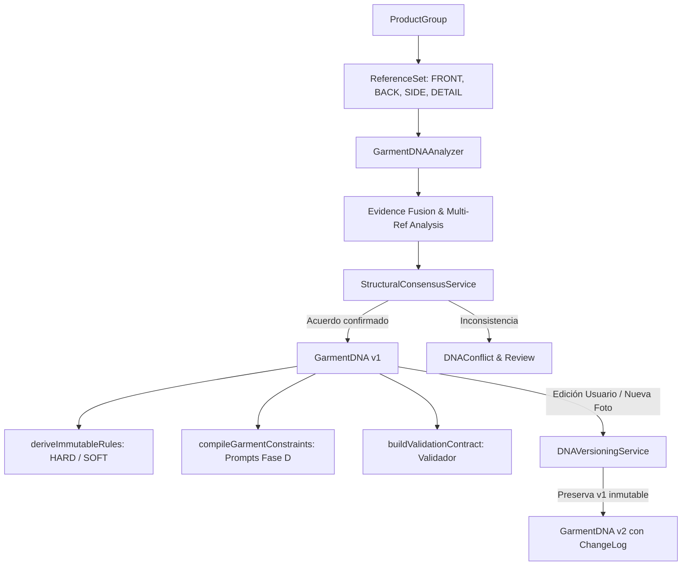

# Documento Técnico: Fase C — Garment DNA & Structural Product Lock

## 1. Arquitectura Implementada

La **Fase C** introduce el modelo formal de **GARMENT_DNA**, una estructura tipada, versionada, inmutable y respaldada por evidencia visual directa que define la moldería y características físicas innegociables de una prenda antes de cualquier etapa generativa.

### Flujo de Datos

---

## 2. Tipos y Esquemas Zod

Los contratos se encuentran formalizados en `types/dna.ts`:
- **`GarmentDNA`**: Esquema principal validado con Zod (`GarmentDNASchema`), que abarca:
  - `silhouette`: tipo (`FITTED`, `STRAIGHT`, `A_LINE`, `OVERSIZED`, `BODYCON`, `FLARED`, `RELAXED`, `UNKNOWN`), status y confidence.
  - `neckline`: tipo, profundidad (`HIGH`, `MEDIUM`, `LOW`, `UNKNOWN`), forma y status.
  - `sleeves`: presencia booleana, tipo, largo (`SLEEVELESS`, `SHORT`, `ELBOW`, `THREE_QUARTER`, `LONG`, `UNKNOWN`) y puño.
  - `buttons`: conteo exacto (`number | null`), ubicación y visibilidad.
  - `pockets`: conteo exacto (`number | null`), ubicación y tipos (plaqué, ojal, invisibles).
  - `closures`: tipos (cierre invisible, botones, broches) y posiciones.
  - `seams`, `pleats`, `ruffles`, `darts`, `belts`, `straps`, `openings`: colecciones de `GarmentFeature`.
  - `embroidery`, `print`: colecciones de `SurfaceDecoration` con placement, cobertura, simetría y patrón repetitivo.
  - `length`: clase (`Mini`, `Corto`, `Midi`, `Tobillero`, `Maxi`) y ratio relativo.
  - `waist`, `hem`: conformación, tipo de cintura y asimetría de ruedo.
  - `materialAppearance`: textura, drape, opacidad y brillo (`sheen`).
  - `geometry`: proporciones relativas normalizadas (`necklineDepthRatio`, `garmentLengthRatio`, etc.).
  - `immutableRules`: lista de `GarmentInvariant`.
  - `evidence`: lista de `GarmentDNAEvidence`.
  - `conflicts`: lista de `DNAConflict`.
  - `auditTrail`: lista de `DNAChangeLog`.

---

## 3. Principio Fundamental: Product Structure vs Variant Appearance

- **1 ProductGroup = 1 GarmentDNA activo**: Variantes cromáticas (ej. vestido en Rojo, Negro, Beige, Verde, Azul) comparten **la misma estructura física**.
- El color es atributo exclusivo de `GarmentVariant` y no duplica el DNA del producto.
- Varias referencias de distintas variantes refuerzan la confianza del mismo DNA mediante consenso estructural.

---

## 4. Evidence Model & Multi-Reference Fusion

Ninguna propiedad estructural existe sin evidencia visual vinculada:
- Cada atributo verificado registra el `referenceId` del recorte físico del cual se extrajo.
- Referencia **FRONT**: Respalda silueta, escote, botones frontales, bolsillos y largo.
- Referencia **BACK**: Respalda cierres traseros, escote posterior y ruedo trasero.
- Referencia **DETAIL**: Respalda bordados, texturas y tipo de costuras.

---

## 5. Manejo Estricto de "UNKNOWN" (Sin Alucinaciones)

- Si no existe fotografía trasera en el conjunto de referencias:
  - `closures.status = 'UNKNOWN'`
  - `closures.types = ['UNKNOWN']`
- El sistema prohíbe inventar detalles no visibles (ej. no inventar un cierre si la espalda no está en las imágenes).

---

## 6. Detección de Conflictos & Consenso (`StructuralConsensusService`)

- Cuando dos o más imágenes muestran valores discrepantes (ej. pechera con 5 botones en foto frontal pero 4 botones en foto de costado):
  - El sistema **no promedia** ni selecciona arbitrariamente.
  - Se genera un objeto `DNAConflict` con severidad `HARD`, detallando cada observación.
  - Se alerta en la interfaz para revisión humana.

---

## 7. Capa de Reglas Inmutables & Validación Futura

- **`deriveImmutableRules(dna)`**: Extrae reglas inmutables clasificadas en:
  - **`HARD`**: Cantidad de botones, tipo de escote, largo de mangas (o sin mangas), cantidad de bolsillos, asimetría de ruedo.
  - **`SOFT`**: Brillo del tejido, drape/caída, textura de tela.
- **`compileGarmentConstraints(dna)`**: Compila las reglas a directivas formales preparadas para los prompts generativos (Fase D).
- **`buildValidationContract(dna)`**: Estructura el contrato de validación que consumirá el validador multimodal en fases posteriores sin acoplarse aún.

---

## 8. Versionado e Inmutabilidad del Historial (`DNAVersioningService`)

- Cada modificación manual o incorporación de nuevas fotografías incrementa la versión (`v1` → `v2`).
- Las versiones previas son **inmutables** y se conserva el identificador `previousVersionId`.
- Cada cambio genera una entrada en `auditTrail` (`DNAChangeLog`) indicando:
  - Propiedad alterada.
  - Valor anterior y valor nuevo.
  - Fuente (`USER`, `AI`, `SYSTEM`).
  - Motivo (`reason`).
  - Timestamp ISO.

---

## 9. Inspector de Garment DNA (`GarmentDNAInspector`)

Componente interactivo en `features/garments/components/GarmentDNAInspector.tsx` integrado en `SceneAnalysisInspector`:
- Pestaña **Estructura Textil**: Visualización y edición en línea de silueta, escote, mangas, botones, bolsillos y cierres.
- Pestaña **Reglas Inmutables**: Lista de reglas `HARD` y `SOFT` derivadas.
- Pestaña **Evidencia Visual**: Mapeo transparente de cada recorte a los atributos que respalda.
- Pestaña **Conflictos**: Panel de alertas para resolver inconsistencias visuales.
- Pestaña **Audit Trail**: Registro cronológico de todas las mutaciones realizadas.

---

## 10. Cobertura de Pruebas Automatizadas (`tests/phase-c-dna.test.ts`)

La suite cubre 10 suites obligatorias con validación de invariantes:
1. **Caso 1**: Prenda con 5 botones visibles → `buttons.count = 5` verificado y regla `HARD`.
2. **Caso 2**: Misma prenda en 3 colores → exactamente 1 `GarmentDNA` para 3 `GarmentVariant`.
3. **Caso 3**: FRONT + BACK → Fusión de evidencia en un solo DNA con cierre trasero verificado.
4. **Caso 4**: Solo FRONT → Atributos traseros estrictamente `UNKNOWN` sin alucinaciones.
5. **Caso 5**: Referencias contradictorias → Detección formal de `DNAConflict`.
6. **Caso 6**: Bordado localizado → Preservación de `placement` y evidencia visual en `SurfaceDecoration`.
7. **Caso 7**: Bolsillos laterales x2 → Conteo verificado `pockets.count = 2`.
8. **Caso 8**: Edición manual de usuario → Creación de versión inmutable v2 con `DNAChangeLog`.
9. **Caso 9**: Incorporación de nueva foto → Incremento de versión preservando el estado anterior.
10. **Caso 10 (Invariantes)**: Compilación de `promptConstraints` y `validationContract`.

---

## 11. Observabilidad

Métricas registradas en `DNAObservability`:
- `dnaAnalysisLatencyMs`
- `referencesUsedCount`
- `propertiesExtractedCount`
- `verifiedPropertiesCount`
- `unknownPropertiesCount`
- `conflictsDetectedCount`
- `manualOverridesCount`
- `dnaVersion`

---

## 12. Preparación para Fase D

Con la Fase C cerrada:
- Los generadores dispondrán de `compileGarmentConstraints(dna)` con reglas inviolables.
- Los shot contracts (`FRONT`, `BACK`, `SIDE`, `ACTION`) tomarán como referencia el recorte físico correspondiente clasificado por su rol visual.
- El validador dispondrá de `buildValidationContract(dna)` con umbrales `HARD` y `SOFT` para rechazar desviaciones estructurales.
