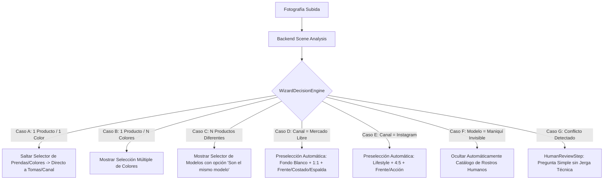

# Documentación: Wizard Decision Engine & Adaptive UX (Catalog AI)

## 1. Visión General

El **`WizardDecisionEngine`** es la capa de inteligencia de interacción que gobierna qué ve el usuario, qué preguntas son estrictamente necesarias y qué pasos pueden saltarse automáticamente sin perder rigor en la moldería de la prenda.

### Principio Rector
> *"El sistema debe deducir proactivamente todo lo posible a partir de los píxeles reales analizados y los presets comerciales elegidos. Al usuario sólo se le consulta aquello que requiere intención humana explícita."*

---

## 2. Reglas Adaptativas Implementadas

### Detalle de Reglas

1. **Caso A (1 Producto / 1 Color):**
   - El motor omite automáticamente el sub-paso de confirmación de prendas y variantes.
   - Avanza de inmediato de la subida a la elección de tomas y destino.

2. **Caso B (1 Producto / N Colores):**
   - El motor presenta directamente las tarjetas de variantes detectadas (*"Encontramos este modelo en X colores"*), permitiendo seleccionar/deseleccionar libremente.

3. **Caso C (Varios Productos):**
   - Agrupa por prenda y permite seleccionar una, varias o fusionar variantes.

4. **Caso D (Destino Mercado Libre):**
   - Configura internamente:
     - `background = WHITE`
     - `aspectRatio = 1:1`
     - `shots = FRONT, SIDE, BACK`
   - Se muestra preseleccionado en el resumen sin forzar re-confirmaciones manuales.

5. **Caso E (Destino Instagram):**
   - Aplica automáticamente preset Lifestyle urbano con formato vertical 4:5.

6. **Caso F (Maniquí Invisible / Ghost Mannequin):**
   - Al seleccionar la opción sin modelo, el selector secundario de rostros y modelos humanas se oculta por completo.

7. **Caso G (Resolución de Conflictos Amigable):**
   - Si el backend detecta inconsistencias de moldería, la UI activa `HumanReviewStep` con microcopy cotidiana:
     - *¿Estas fotos corresponden al mismo modelo en distintos colores?*
     - [Sí, son el mismo modelo] / [No, son cortes diferentes]
   - Jamás expone términos como `ProductGroup`, `BoundingBox` o `Confidence`.

8. **Caso H (Manejo de Errores Accionables - `FriendlyErrorMapper`):**
   - Foto borrosa: *"La imagen está demasiado borrosa o pequeña para detectar los detalles de confección."*
   - Sin prendas: *"No encontramos una prenda claramente visible. Asegurate de que la prenda se aprecie en plano general."*
   - Archivo inválido: *"No pudimos leer esta imagen. Probá con un archivo JPG, PNG o WebP."*

---

## 3. Las 4 Macro-Etapas Visibles

El usuario nunca ve más de 4 etapas en la barra de progreso superior:
1. **1. Subir** (`UPLOAD` / `WELCOME`)
2. **2. Elegir** (`PRODUCTS` / `SHOTS`)
3. **3. Preparar** (`DESTINATION` / `STYLE` / `MODEL`)
4. **4. Crear** (`SUMMARY` / `GENERATION` / `RESULTS`)

---

## 4. Persistencia de Estado en Navegación Atrás / Adelante

- El estado de la producción (`products`, `shots`, `destination`, `style`, `modelId`) reside en el contenedor orquestador React.
- El usuario puede volver hacia atrás en cualquier momento para cambiar el destino o modificar un color sin perder sus elecciones previas ni reiniciar formularios.

---

## 5. Visualización Dinámica de Resultados Parciales

Durante la etapa de generación (`GenerationStep.tsx`), el usuario no ve un loader genérico:
- Cada variante cromática dispone de una fila interactiva con checklist de tomas:
  - `Negro: [✓ Frente] [✓ Costado] [⏳ Espalda] [○ Acción]`
- Las miniaturas de las imágenes aprobadas por el validador emergen en tiempo real tan pronto como son generadas.
